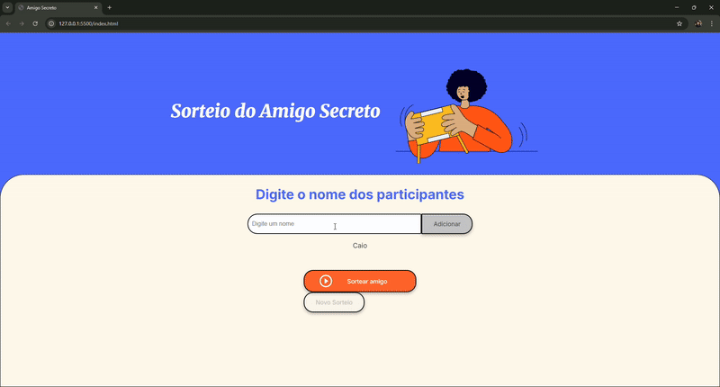

# Sorteio do Amigo Secreto 🎁


### 🎯 Sobre o Projeto

Este é o desenvolvimento do desafio **"Sorteio do Amigo Secreto"**, proposto como parte do programa Oracle Next Education (ONE) em parceria com a Alura. O projeto foi construído com foco em uma interface limpa, validações robustas e uma ótima experiência de usuário, indo além dos requisitos básicos para criar uma aplicação completa e funcional.

O desenvolvimento foi um excelente exercício para a prática de **manipulação do DOM** e **gerenciamento de estado** em JavaScript. O maior desafio foi criar um fluxo de usuário lógico e à prova de erros, implementando validações e estados condicionais para os botões, como a ativação inteligente do botão de reinício após a realização de um sorteio. Para acelerar o desenvolvimento e explorar fluxos de trabalho modernos, a estruturação da lógica, a depuração do código e a elaboração desta documentação foram realizadas com o auxílio de prompts em LLMs, transformando a I.A. em uma parceira no processo de aprendizado e criação, além da experimentação prévia da depuração do código pelos desafios propostos e listados no Trello compartilhado.

---

### 🖼️ Demonstração do Projeto



---

### ✨ Funcionalidades Principais

- **Adição de Participantes:** Interface intuitiva para adicionar amigos à lista do sorteio.
- **Validação de Nomes:** Impede a adição de nomes vazios ou duplicados.
- **Validação de Sorteio:** Exige um número mínimo de participantes para o sorteio ser válido.
- **Sorteio Aleatório:** Lógica de sorteio justa que seleciona aleatoriamente um nome da lista.
- **Botão de Reinício Inteligente:** Fica desabilitado até que um sorteio seja realizado, guiando o usuário.
- **Interface Responsiva:** Design que se adapta a diferentes tamanhos de tela.

---

### 🛠️ Tecnologias Utilizadas

- 
- 
- 

---

### 🚀 Acesso ao Projeto

Você pode visualizar o projeto em funcionamento através do GitHub Pages:

**[Clique aqui para acessar o Sorteio do Amigo Secreto](https://fefalipe.github.io/Amigo-Secreto/)**

Ou, se preferir, clone o repositório e abra o arquivo `index.html` localmente:
```bash
git clone [https://github.com/fefalipe/Amigo-Secreto.git](https://github.com/fefalipe/Amigo-Secreto.git)
cd Amigo-Secreto
# Abra o arquivo index.html no seu navegador
